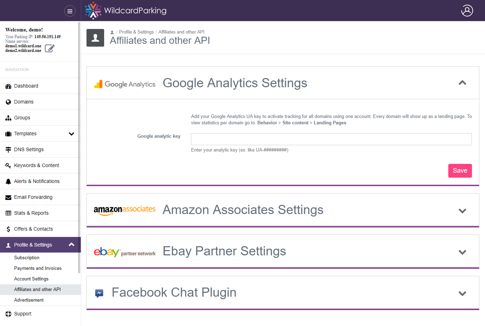
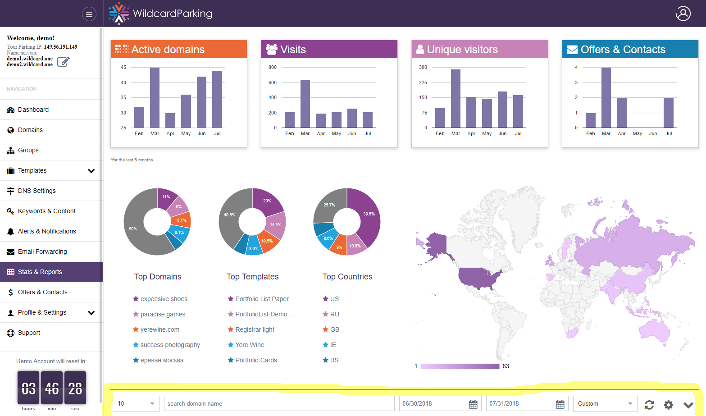

# Analytic tools

### Google Analytic

You can easily integrate all your parked domains with your own google analytic to track visits with more details

### Wildcard Parking independent analytic

Aside from option to enable google analytic you can always see our own statistics.

  
We distinguish new visitors from simple page refreshes, save visitor county/city information to analyse world wide spread and allow you to filter information based on most fields to analyse situation.

