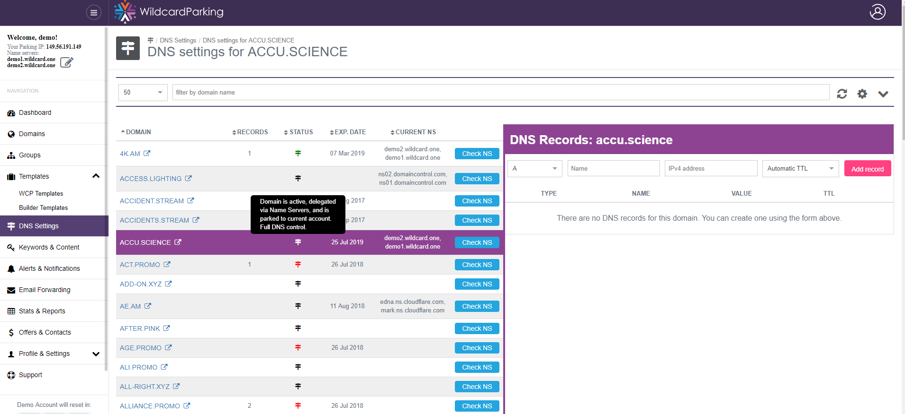

# Dns Settings

### How to 

For the domains [parked via NS records](https://wiki.wildcardparking.com/parking-options#parking-via-ns-records) you will be able to use [DNS Settings page](https://wildcardparking.com/my/dns-settings) to control your DNS, and even forward it to other platforms via A records \(temporary, hopefully\) !

The Dns Settings page shows domains with details regarding to the parking state, You can see domains with ready to use DNS settings in green. 

Click on the domain you wont to work with and use the details table with form from the right.  
Bulk actions also available.

### Subscription Restrictions

For Free account you will be able to add only 1 custom dns record per domain. \*this restriction may be changed in future.

Read more details at [wildcardparking.com](https://wildcardparking.com/#plans-table) directly.

