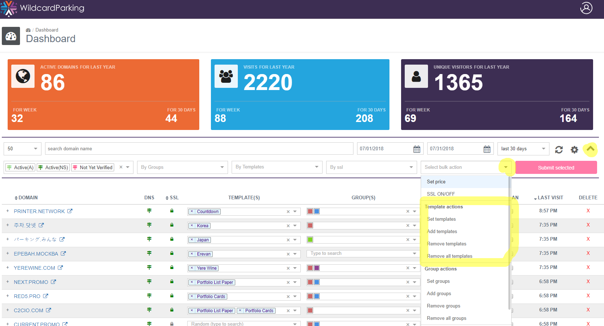

# Domain tools

## Domain details

We strive collect all important information on parked domains such as whois details, expiration/registration date. There is a separate Domains Page that will show all details in the table and you can click on the domain name from most of the pages to go to the Domain details page, where you can see provided services settings related to that domain.

## Domain unique keywords and content

On [Keywords & Content page](https://wildcardparking.com/my/keywords-settings) you can fill key words for each domain. This information is used by some templates that support dynamic content or SEO descriptions. For straight example this keywords are used to request related to domain name items for affiliate stores on Ebay and Amzaon. 

## Domain groups

You organize domains by groups to easier apply common changes, this is internal feature that no one except you will see. One of the intended use cases is to group private domain you want to exclude from your selling portfolio - used on all [Portfolio Templates](https://templates.wildcardparking.com/portfolio_list)

## Domain - template relations

You can list templates that will show for particular domain on Dashboard or Domains pages. Use comprehensive bulk tools if you need to change many domains at once. With bulk tools you can add a template list to existing templates of domains, or replace existing with new once as you need.

  

