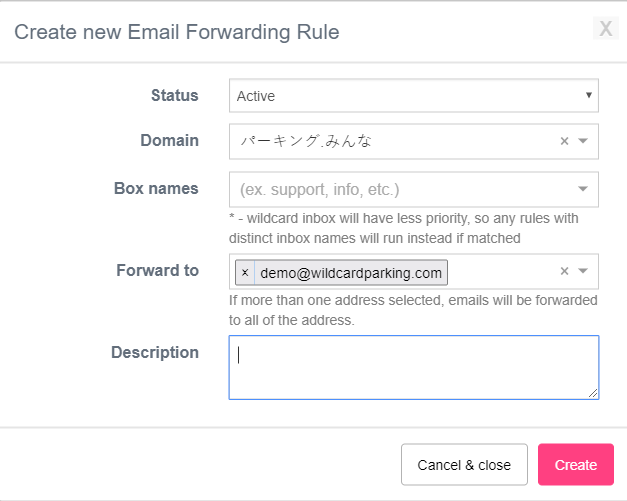

# Email Forwarding

### How to add an inbox

Navigate to [Email Forwarding page](https://wildcardparking.com/my/email-forwarding) and click "Create new e-mail forwarding" on the top right.

  
There are 4 main fields

* **Domain**, to which the inbox will be related
* **Box name**, ****username part of the e-mail
* **Forward to**, any existing email to forward messages to 
* **Description**, any text for your reference only.

It may take few minutes to take effect, and the domain should have the following MX record:

| TYPE | NAME | VALUE |
| --- | --- |
| MX | @ | 10 forwarder.wildcardparking.com |


If you are adding an inbox to domain parked with our [NS records](https://wiki.wildcardparking.com/parking-options#parking-via-ns-records) than this MX record will be created automatically. And you will not be requested to do any additional step.


### Subscription Restrictions

Free account can only have up to 5 inboxes in total, can forward only to their account email.

Starting with basic subscription you will be ably to forward to any other emails and few emails per inbox too.  Read more details at [wildcardparking.com](https://wildcardparking.com/#plans-table) directly.

