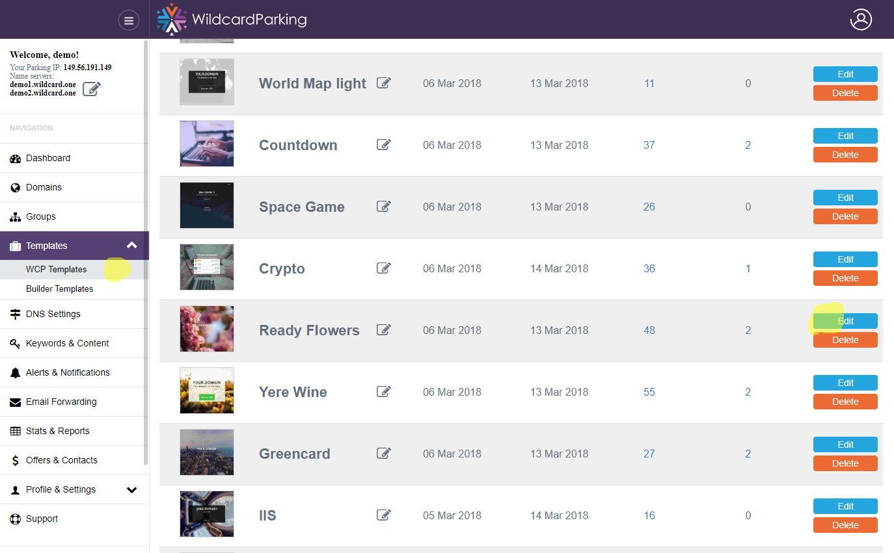
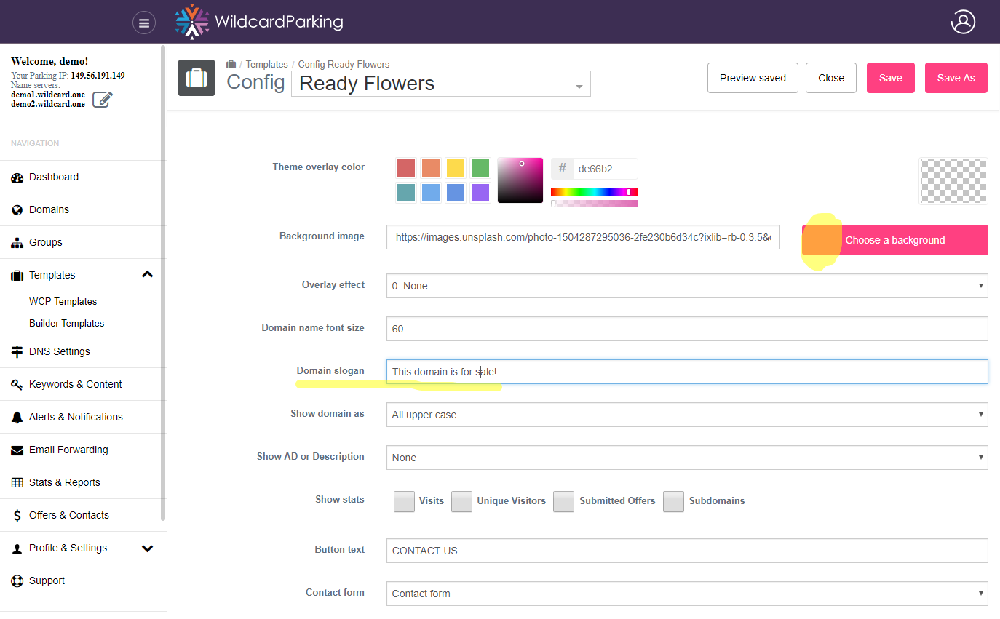
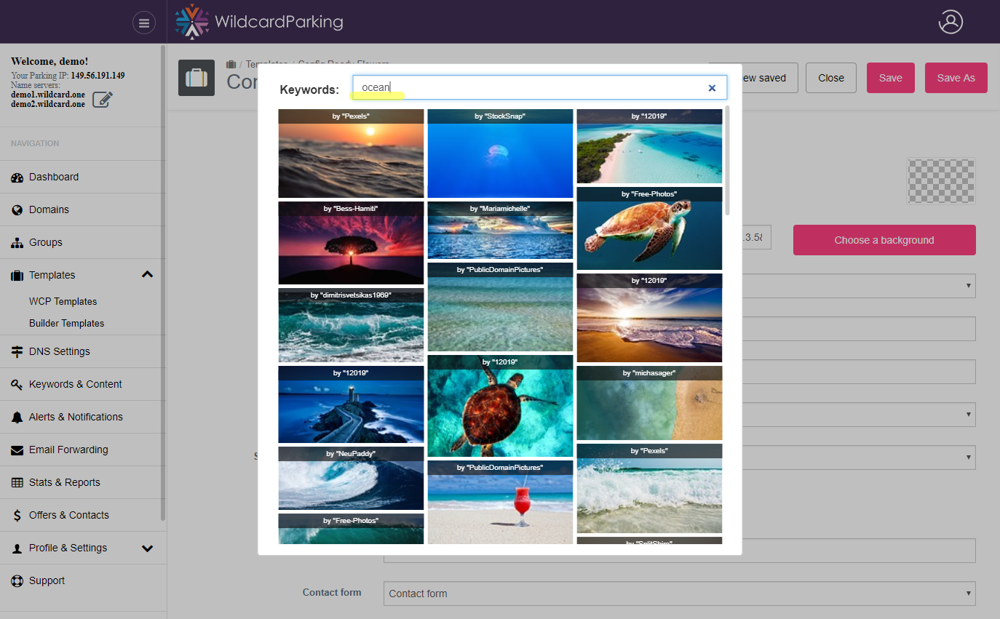

# Templates

## Template types

There are many different kind of templates and more are coming, see the full list [on the site](https://wildcardparking.com/templates).

### Straight templates:

Simple templates to show your domain name with style and offer it for sale. \(Or for upcoming projects on "construction pages"\)

* [Whiteboard](https://templates.wildcardparking.com/whiteboard/), [Exploding Text](https://templates.wildcardparking.com/exploded_text), [Minimal](https://templates.wildcardparking.com/particles), [Countdown](https://templates.wildcardparking.com/project)

### Portfolio:

Allows you to list your domains grouped by extensions, with search bar and options to show statistics and prices per domain.

* [Portfolio Cards](https://templates.wildcardparking.com/portfolio_cards), [Portfolio List](https://templates.wildcardparking.com/portfolio_list), [Portfolio Cloud](https://templates.wildcardparking.com/cloud)

### E-commerce templates:

Allows you to easily turn your key efficient domains to affiliate stores, you can use unique text descriptions per domain for better SEO optimization.

* [Amazon Shop](https://templates.wildcardparking.com/amazon_shop), [Amazon Light](https://templates.wildcardparking.com/amazon1), [Ebay Shop](https://templates.wildcardparking.com/ebay_shop), [Ebay light](https://templates.wildcardparking.com/ebay1)

### Fun \( attractive \)

This series of templates designed to have your visitors to hand around a bit on your site. This includes web games, google map elements, animated backgrounds etc.

* [Panorama](https://templates.wildcardparking.com/panorama), [Particle Stream](https://templates.wildcardparking.com/particle_stream), [Space Game](https://templates.wildcardparking.com/space_game), [Space Journey](https://templates.wildcardparking.com/space_journey), [World Map](https://templates.wildcardparking.com/world_map)

### Other:

Other templates with unique usages, be in crypto trends or use any third site under iframe!

* [Crypto](https://templates.wildcardparking.com/crypto), [Iframe](https://templates.wildcardparking.com/iframe)

### Registrar:

Unique type of templates having meaning for registrar companies.

* [Registrar 1](https://templates.wildcardparking.com/registrar1), [Registrar 2](https://templates.wildcardparking.com/registrar2), [Registrar 3](https://templates.wildcardparking.com/registrar3)

## Template Settings

To edit any template - navigate to Templates page WCP Templates tab and pick one.

Templates settings contain all options to customize content on the template per your needs, you can edit texts change colors and backgrounds, hide parts, but can not change the page structure much \(if you need something with your own html you could use Page Builder or contact our support team.\)

You can pick a background image from one of the 3-d party photo services such as unsplash, pixabay searching their stocks by keywords 


Note: you can [login to demo account](https://wildcardparking.com/user/login?demo_login=1) to play and see how templates settings work


